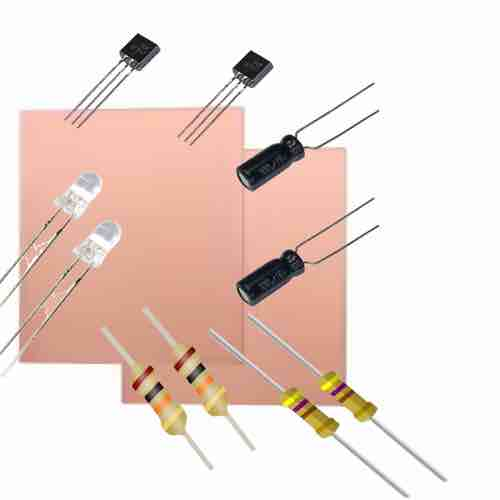
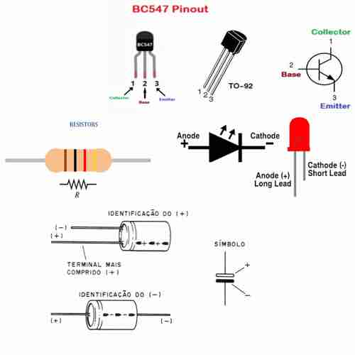
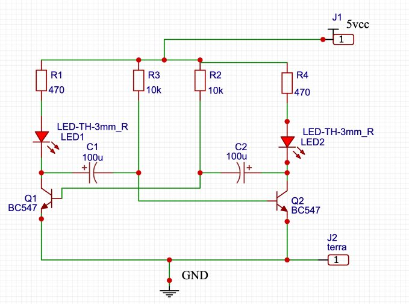
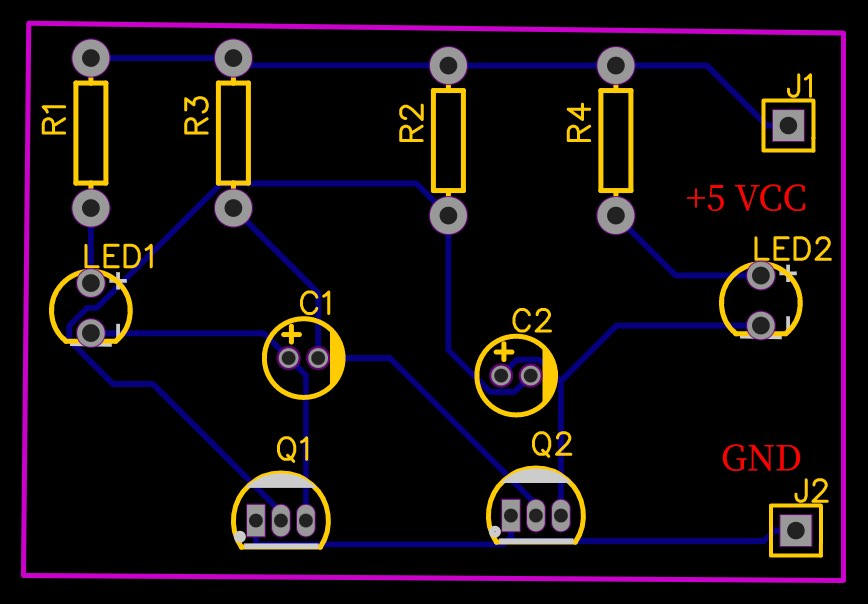
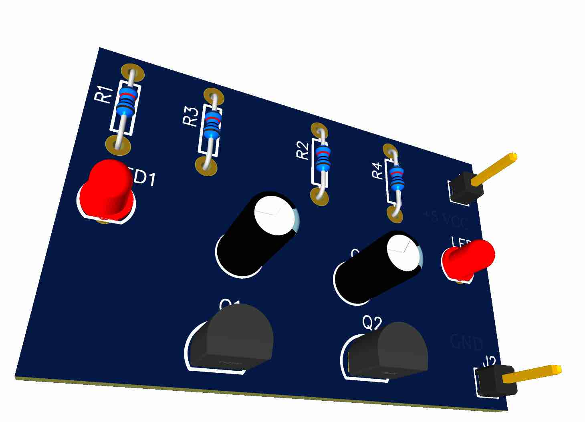
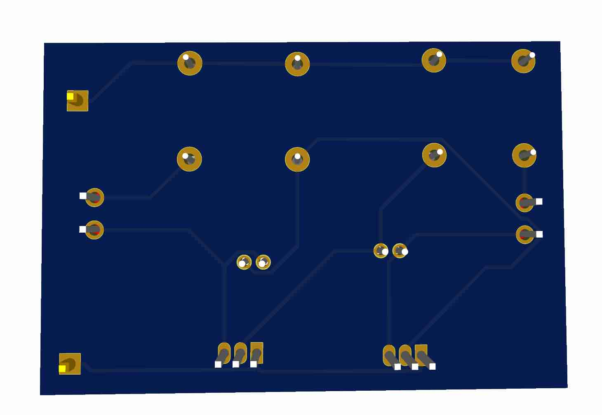
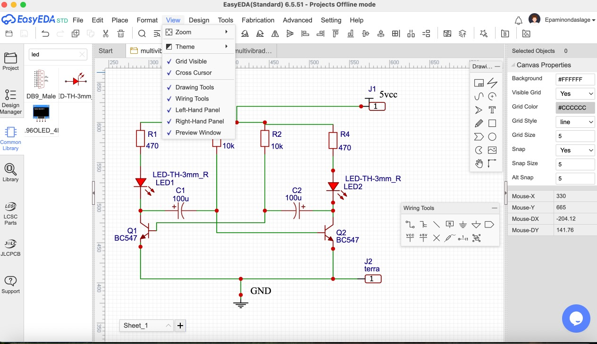
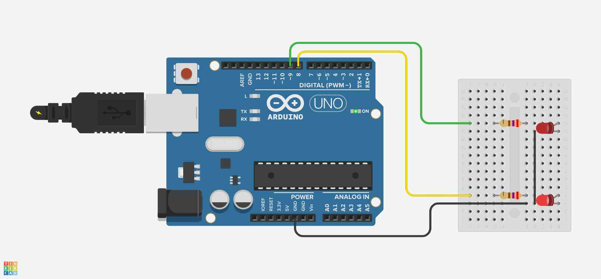

# DEE- Curso de Eletrotécnica 
# Laboratório de Instalações Prediais

## **Aula Prática – Confecção de PCI para Multivibrador Astável**

## Título
Multivibrador Astável com dois Transistores 

## Objetivos da Prática

- **Compreender o funcionamento do multivibrador astável** utilizando transistores BJT, analisando como a realimentação cruzada entre capacitores e resistores gera a oscilação.  
- **Desenvolver habilidades práticas de eletrônica** através do projeto, confecção e teste de uma placa de circuito impresso (PCI) para o circuito.  
- **Observar na prática o piscar alternado de dois LEDs**, entendendo a relação entre a constante de tempo RC e a frequência de oscilação.  
- **Comparar soluções analógica e digital**, implementando o mesmo efeito com Arduino e destacando as diferenças nos princípios de funcionamento entre hardware discreto e programação.  
- **Estimular a análise crítica** sobre vantagens, limitações e aplicações reais do multivibrador em sistemas eletrônicos.  

---

## Componentes Utilizados

| **Componente** | **Quantidade** | **Função** |
|----------------|----------------|------------|
| **[Transistor BJT-BC547](transistor-BJT.md) (Q1 e Q2)** | 2 | Alternam a condução, criando a oscilação. |
| **[Capacitores](capacitores.md) 100 µF** | 2 | Definem o tempo em que cada LED fica aceso (constante de tempo). |
| **[Resistores](tutorial-Resistores.md) 10 kΩ (R2 e R3)** | 2 | Polarizam as bases dos transistores. |
| **[Resistores](tutorial-Resistores.md) 470 Ω (R1 e R4)** | 2 | Limitam a corrente que passa pelos LEDs. |
| **[LEDs](tutorial-LEDs.md)** | 2 | Indicam visualmente a alternância do circuito. |
| **Conector para fonte 5 V** | 1 | Alimenta o circuito. |

---

## Materiais para Confecção da PCI

- Placa fenolite cobreada (5 × 7 cm)  
- Percloreto de ferro ou solução para corrosão  
- Impressora a laser ou papel para transfer  
- Ferro de passar roupa ou laminadora  
- Fita isolante ou caneta para retoques  
- Furadeira manual ou mini-retífica (broca 1mm)  
- Estanho, ferro de solda e sugador  
- Multímetro

---

## Etapas da Aula

### A. Fundamentação Teórica 

O **multivibrador astável** é um circuito eletrônico **oscilador** que gera **ondas quadradas contínuas** sem necessidade de sinal externo.  
Ele alterna automaticamente entre dois estados, produzindo duas saídas:

- **Q** → Saída direta (onda quadrada normal).  
- **Q̅** → Saída inversora (onda quadrada invertida, com defasagem de 180° em relação à saída **Q**).

> **Nota:** Caso o caractere `Q̅` (Q barra) não seja exibido corretamente no seu visualizador, ele pode aparecer como **Q'** ou **Q_inv**.

O coração deste circuito é o **[transistor BJT](transistor-BJT.md)**, um dispositivo semicondutor de três camadas que atua como chave ou amplificador de corrente, fundamental em inúmeros circuitos eletrônicos.

---

---

### **Princípio de Funcionamento**

### **1. Início do ciclo**
- Suponha que o transistor **Q1** esteja saturado (**ligado**).  
- Nesse momento, o transistor **Q2** estará em corte (**desligado**).  
- Assim:
  - **Saída Q** → Nível **baixo (0)**.  
  - **Saída Q̅** → Nível **alto (1)**.

---

### **2. Carregamento dos [capacitores](capacitores.md) (C1 e C2)**
- O capacitor **C1** começa a **carregar** através do resistor **R2**, criando um **atraso controlado**.  
- Quando a tensão no capacitor atingir o **limiar de disparo**, **Q1 desliga** e **Q2 liga**.

---

### **3. Troca de estados**
- Agora, o transistor **Q2** entra em saturação, invertendo as saídas:
  - **Saída Q̅** → Vai para nível **baixo (0)**.  
  - **Saída Q** → Vai para nível **alto (1)**.
- Ao mesmo tempo, **C2** começa a carregar, preparando a próxima comutação.

---

### **4. Oscilação contínua**
- O processo se repete indefinidamente, produzindo sinais alternados nas saídas.  
- O resultado é uma **onda quadrada** contínua, ideal para gerar **clocks** e sinais digitais.

---

### **5.Função dos Componentes**

| **Componente** | **Função** |
|----------------|------------|
| **Q1 e Q2** | [Transistores](transistor-BJT.md) que alternam entre saturação e corte, gerando a oscilação. |
| **C1 e C2** | [Capacitores](capacitores.md) determinam, junto com os resistores, o tempo de cada meio-ciclo da oscilação. |
| **R2 e R3** | [Resistores](tutorial-Resistores.md) controlam a polarização das bases dos transistores e definem, junto aos capacitores, a frequência. |
| **R1 e R4** | Limitam a corrente nos [LEDs](tutorial-LEDs.md) ou saídas **Q** e **Q̅**. |

---

### **6.Equações do Circuito**

O período total da oscilação (T) pode ser estimado por:

`T ≈ 0,693 × (R2 + R3) × C`

Onde:

- **C** → Capacitância (C1 = C2, caso sejam iguais).  
- **R2** e **R3** → Resistores iguais para um circuito simétrico.

A frequência de oscilação é dada por:

`f = 1 / T`

> **Observação:** Se os resistores ou capacitores tiverem valores diferentes, o ciclo não será simétrico, resultando em tempos diferentes para nível alto e baixo.

---

### **7.Forma de Onda**

- A saída **Q** gera uma **onda quadrada**.  
- A saída **Q̅** gera uma **onda quadrada invertida**, defasada 180° em relação à saída **Q**.

---

### **8.Aplicações Práticas**
- Luzes de decoração (pisca-pisca de Natal).  
- Sinalizadores de alerta.  
- Temporizadores básicos.  
- Geração de clock para circuitos digitais simples.  
- Base de estudo para flip-flops e eletrônica sequencial.

---

## B. Parte Prática 

### **1.Estudo do Circuito**
Apresentar o **esquemático** do multivibrador:

---
### **2. Desenho do circuito com os componetntes**

---
### **3. Montagem do circuito em uma PCB**

Video no Youtube: https://www.youtube.com/watch?v=0rsv6dMTNQA

### **4. Desenho do Layout da PCI**

**Ferramentas sugeridas:**
- **KiCad**, **EasyEDA**, **Proteus** ou **Fritzing**.

### Ferramenta CAD Utilizada: EasyEDA

Neste projeto utilizamos o **[EasyEDA](https://easyeda.com/)** por ser uma plataforma **gratuita**, **simples** e **fácil de operar**, ideal para o desenvolvimento de **esquemáticos** e **placas de circuito impresso (PCBs)**.

### **Motivos da Escolha**
- 💻 **Plataforma online**, sem necessidade de instalação.  
- 📚 **Biblioteca extensa** de componentes, incluindo códigos **LCSC** para integração direta com fornecedores.  
- ⚡ **Ferramentas integradas** para captura de esquemático, layout de PCB e simulação.  
- 📝 **Geração automática** de arquivos de produção:  
  - **Gerbers**  
  - **BOM (Bill of Materials)**  
  - **Pick & Place**  
- 🔗 **Integração com serviços de fabricação e montagem** diretamente pela plataforma.

### **Fluxo de Trabalho Simplificado**
a. **Criação do Esquemático**  
   - Inserção de símbolos e conexões utilizando etiquetas de rede (*NetLabels*).  

b. **Anotação Automática (RefDes)**  
   - Numeração dos componentes e verificação elétrica (*ERC*).  

c. **Associação de Footprints**  
   - Vincular corretamente cada componente ao respectivo encapsulamento físico.

d. **Posicionamento e Roteamento**  
   - Organização física dos componentes e roteamento das trilhas de forma manual ou semi-automática.

e. **Verificação DRC**  
   - Conferência das regras de design conforme especificações do fabricante da PCB.

f. **Geração de Arquivos Finais**  
   - Exportação dos arquivos necessários para fabricação e montagem.

---

> **Acesse a ferramenta:** [https://easyeda.com/](https://easyeda.com/)  
> O EasyEDA é uma solução completa para projetos eletrônicos, desde a concepção até a produção.

**Passos:**
1. Criar o esquema no software.  
2. Posicionar os componentes:  
   - LEDs na parte superior.  
   - Transistores próximos aos LEDs.  
   - Capacitores próximos às bases.  
   - Resistores de 470 Ω em série com os LEDs.  
   - Conector de entrada de 5V no canto inferior.  
3. Utilizar trilhas grossas para alimentação (Vcc e GND).  
4. Identificar polaridade dos LEDs e capacitores.

---

### **5. Transferência para Placa Física**
1. Imprimir o layout **espelhado** em papel couchê ou sulfite.  
2. Limpar a placa com **palha de aço** e álcool.  
3. Transferir o desenho com ferro de passar ou laminadora.  
4. Remover o papel em água morna e retocar falhas.

---

### **6. Corrosão da Placa**
1. Colocar a placa em recipiente plástico.  
2. Cobrir com **percloreto de ferro**.  
3. Mexer suavemente até remover todo o cobre exposto.  
4. Lavar em água corrente e secar.

> ⚠ **Segurança:** Utilize **luvas, óculos de proteção** e trabalhe em local ventilado.

---

### **7. Furação**
- Utilizar **broca de 1 mm** para resistores, LEDs e transistores.  
- Furos maiores para conectores.

---

### **8. Soldagem**
**Dicas importantes:**
- Soldar primeiro os **componentes menores**.  
- Verificar **polaridade** de LEDs e capacitores.  
- Evitar excesso de solda.  
- Usar **sugador** para correções.

---

### **9. Teste do Circuito**
1. Conectar a fonte de **5V**.  
2. Observar os LEDs piscando alternadamente.  
3. Caso haja falhas:  
   - Verificar polaridade dos componentes.  
   - Testar transistores com multímetro.  
   - Conferir a tensão de alimentação.

---

### ** 10. Arquivo GERBER

Um **arquivo Gerber** é um tipo de arquivo padrão usado na indústria de eletrônica para **fabricar placas de circuito impresso (PCBs – Printed Circuit Boards)**.  

Ele contém todas as informações gráficas necessárias para que uma fábrica consiga produzir a placa, como:  

- **Trilhas de cobre** (as conexões elétricas do circuito).  
- **Furos e pads** (onde serão soldados os componentes).  
- **Máscara de solda** (a camada que protege o cobre).  
- **Serigrafia** (os textos e símbolos impressos na placa).  
- **Cortes da placa** (dimensões e contorno).  

## Características principais
- Geralmente, o projeto de PCB é exportado em **vários arquivos Gerber**, cada um representando uma camada diferente da placa.  
- É o formato aceito pela maioria das fábricas no mundo.  
- Costuma vir acompanhado de um **arquivo de furação (Excellon Drill)** que define os furos da placa.  

Este porjeto está disponivel para download em [arq](gerber)

## C. Montagem do circuito utilizando o Arduino

### 1. **Descrição do Código: Multivibrador Astável com Arduino Uno**

Este código implementa o funcionamento de um **multivibrador astável** utilizando um **Arduino Uno** e dois LEDs.  
O objetivo é criar um efeito de **pisca-pisca alternado**, onde os LEDs acendem e apagam de forma intercalada em intervalos de tempo pré-definidos.

---

### 2. **Componentes Utilizados**
- **Arduino Uno**  
- **2 LEDs** (exemplo: vermelho e verde)  
- **2 resistores** de **220 Ω** (para limitar a corrente dos LEDs)

