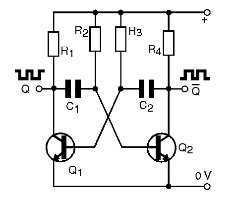
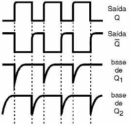
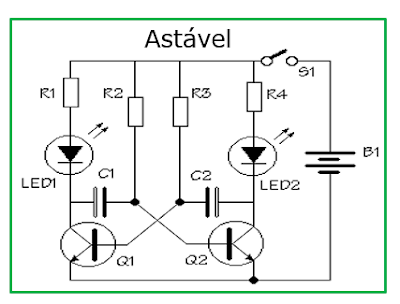

# **Multivibrador Astável com Dois Transistores – Saídas Q e Q̅**

O **multivibrador astável** é um circuito eletrônico **oscilador** que gera **ondas quadradas contínuas** sem necessidade de sinal externo.  
Ele alterna automaticamente entre dois estados, produzindo duas saídas:

- **Q** → Saída direta (onda quadrada normal).  
- **Q̅** → Saída inversora (onda quadrada invertida, com defasagem de 180° em relação à saída **Q**).

> **Nota:** Caso o caractere `Q̅` (Q barra) não seja exibido corretamente no seu visualizador, ele pode aparecer como **Q'** ou **Q_inv**.

---



---

## **Princípio de Funcionamento**

### **1. Início do ciclo**
- Suponha que o transistor **Q1** esteja saturado (**ligado**).  
- Nesse momento, o transistor **Q2** estará em corte (**desligado**).  
- Assim:
  - **Saída Q** → Nível **baixo (0)**.  
  - **Saída Q̅** → Nível **alto (1)**.

---

### **2. Carregamento dos capacitores (C1 e C2)**
- O capacitor **C1** começa a **carregar** através do resistor **R2**, criando um **atraso controlado**.  
- Quando a tensão no capacitor atingir o **limiar de disparo**, **Q1 desliga** e **Q2 liga**.

---

### **3. Troca de estados**
- Agora, o transistor **Q2** entra em saturação, invertendo as saídas:
  - **Saída Q̅** → Vai para nível **baixo (0)**.  
  - **Saída Q** → Vai para nível **alto (1)**.
- Ao mesmo tempo, **C2** começa a carregar, preparando a próxima comutação.

---

### **4. Oscilação contínua**
- O processo se repete indefinidamente, produzindo sinais alternados nas saídas.  
- O resultado é uma **onda quadrada** contínua, ideal para gerar **clocks** e sinais digitais.

---

## **Função dos Componentes**

| **Componente** | **Função** |
|----------------|------------|
| **Q1 e Q2** | Transistores que alternam entre saturação e corte, gerando a oscilação. |
| **C1 e C2** | Determinam, junto com os resistores, o tempo de cada meio-ciclo da oscilação. |
| **R2 e R3** | Controlam a polarização das bases dos transistores e definem, junto aos capacitores, a frequência. |
| **R1 e R4** | Limitam a corrente nos LEDs ou saídas **Q** e **Q̅**. |

---

## **Equações do Circuito**

O período total da oscilação (**T**) pode ser estimado por:

\[
T \approx 0,693 \times (R2 + R3) \times C
\]

Onde:
- **C** → Capacitância (C1 = C2, caso sejam iguais).  
- **R2** e **R3** → Resistores iguais para um circuito simétrico.

A **frequência** de oscilação é dada por:

\[
f = \frac{1}{T}
\]

> **Observação:** Se os resistores ou capacitores tiverem valores diferentes, o ciclo não será simétrico, resultando em tempos diferentes para nível alto e baixo.

---

## **Forma de Onda**



- A saída **Q** gera uma **onda quadrada**.  
- A saída **Q̅** gera uma **onda quadrada invertida**, defasada 180° em relação à saída **Q**.

---

## **Aplicações Práticas**
- Luzes de decoração (pisca-pisca de Natal).  
- Sinalizadores de alerta.  
- Temporizadores básicos.  
- Geração de clock para circuitos digitais simples.  
- Base de estudo para flip-flops e eletrônica sequencial.

---

# **Aula Prática – Confecção de PCI para Multivibrador Astável**

## **Objetivo**
Ensinar aos alunos como projetar, confeccionar e testar uma **placa de circuito impresso (PCI)** para um **multivibrador astável** que faz dois LEDs piscarem alternadamente.

---

## **Componentes Utilizados**

| **Componente** | **Quantidade** | **Função** |
|----------------|----------------|------------|
| **BC547 (Q1 e Q2)** | 2 | Alternam a condução, criando a oscilação. |
| **Capacitores 100 µF** | 2 | Definem o tempo em que cada LED fica aceso (constante de tempo). |
| **Resistores 10 kΩ (R2 e R3)** | 2 | Polarizam as bases dos transistores. |
| **Resistores 470 Ω (R1 e R4)** | 2 | Limitam a corrente que passa pelos LEDs. |
| **LEDs** | 2 | Indicam visualmente a alternância do circuito. |
| **Conector para fonte 5 V** | 1 | Alimenta o circuito. |
| **Interruptor S1 (opcional)** | 1 | Liga/desliga o circuito. |

---

## **Materiais para Confecção da PCI**
- Placa fenolite cobreada (5 × 7 cm)  
- Percloreto de ferro ou solução para corrosão  
- Impressora a laser ou papel para transfer  
- Ferro de passar roupa ou laminadora  
- Fita isolante ou caneta para retoques  
- Furadeira manual ou mini-retífica (broca 1mm)  
- Estanho, ferro de solda e sugador  
- Multímetro

---

## **Etapas da Aula**

### **1. Estudo do Circuito**
Apresentar o **esquemático** do multivibrador:

```
Vcc (5V) → R1 → LED1 → Coletor Q1
Capacitor C1 cruzando para base Q2
Vcc (5V) → R4 → LED2 → Coletor Q2
Capacitor C2 cruzando para base Q1
R2 e R3 indo das bases para Vcc
```

**Explicação:**
- Quando **Q1 satura**, LED1 acende e LED2 apaga.  
- Capacitores **C1 e C2** definem o tempo de comutação.  
- LEDs alternam indefinidamente.

---

### **2. Desenho do Layout da PCI**
**Ferramentas sugeridas:**
- **KiCad**, **EasyEDA**, **Proteus** ou **Fritzing**.

**Passos:**
1. Criar o esquema no software.  
2. Posicionar os componentes:  
   - LEDs na parte superior.  
   - Transistores próximos aos LEDs.  
   - Capacitores próximos às bases.  
   - Resistores de 470 Ω em série com os LEDs.  
   - Conector de entrada de 5V no canto inferior.  
3. Utilizar trilhas grossas para alimentação (Vcc e GND).  
4. Identificar polaridade dos LEDs e capacitores.

---

### **3. Transferência para Placa Física**
1. Imprimir o layout **espelhado** em papel couchê ou sulfite.  
2. Limpar a placa com **palha de aço** e álcool.  
3. Transferir o desenho com ferro de passar ou laminadora.  
4. Remover o papel em água morna e retocar falhas.

---

### **4. Corrosão da Placa**
1. Colocar a placa em recipiente plástico.  
2. Cobrir com **percloreto de ferro**.  
3. Mexer suavemente até remover todo o cobre exposto.  
4. Lavar em água corrente e secar.

> ⚠ **Segurança:** Utilize **luvas, óculos de proteção** e trabalhe em local ventilado.

---

### **5. Furação**
- Utilizar **broca de 1 mm** para resistores, LEDs e transistores.  
- Furos maiores para conectores.

---

### **6. Soldagem**
**Dicas importantes:**
- Soldar primeiro os **componentes menores**.  
- Verificar **polaridade** de LEDs e capacitores.  
- Evitar excesso de solda.  
- Usar **sugador** para correções.

---

### **7. Teste do Circuito**
1. Conectar a fonte de **5V**.  
2. Observar os LEDs piscando alternadamente.  
3. Caso haja falhas:  
   - Verificar polaridade dos componentes.  
   - Testar transistores com multímetro.  
   - Conferir a tensão de alimentação.

---

## **Layout Recomendado**



---

## **Resultados Esperados**
- LEDs piscando **alternadamente** a cada ~1 segundo.  
- Funcionamento estável com alimentação de **5V**.
