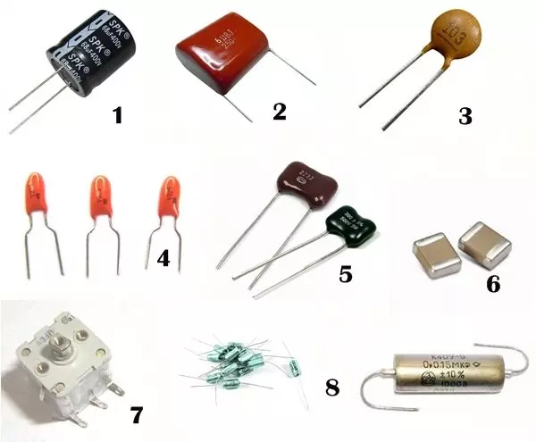

# Mini Tutorial sobre Capacitores

## 1. O que é um Capacitor?
Um **capacitor** é um componente eletrônico capaz de **armazenar energia elétrica** na forma de campo elétrico.  
Ele é formado basicamente por **duas placas condutoras** separadas por um material isolante (dielétrico).

---

## 2. Unidade de Medida
A grandeza que caracteriza o capacitor é a **capacitância (C)**, medida em **farads (F)**.

- **1 farad (F)** = capacidade de armazenar 1 coulomb (C) de carga elétrica por 1 volt (V).  
- Valores comuns em eletrônica: **pF (picofarads), nF (nanofarads), µF (microfarads)**.

---

## 3. Tipos de Capacitores

1. **Eletrolíticos**  
   - Grandes valores (µF a centenas de µF).  
   - Polarizados (têm positivo e negativo).  
   - Usados em filtros de fontes de energia.

2. **Poliéster, Polipropileno, etc.**  
   - Boa estabilidade.  
   - Usados em áudio, RF e temporização.

3. **Cerâmicos**  
   - Pequenos valores de capacitância (pF a nF).  
   - Usados em circuitos de alta frequência e desacoplamento.

4. **Tântalo**  
   - Estáveis e com alta capacitância por volume.  
   - Também polarizados.

5. **Capacitor de Mica**
   - O material dielétrico deste capacitor, obviamente, é a mica. As placas são de prata, e estas envolvem a folha de mica. Altamente estável quanto à temperatura e possui baixa perda de carga. Muito usado sem circuitos osciladores e circuitos ressonantes.

6. **Capacitor SMD**
   - São usados em todo tipo de equipamentos eletrônicos. O material dielétrico destes capacitores pode ser de cerâmica, tântalo, entre outros. Por serem muito pequenos, geralmente são montados nos circuitos por robôs. Ele não possui terminais, este componente é de montagem em superfície.

7. **Capacitor variável**
- São usados em circuitos sintonizados, como a sintonia de um rádio. O material dielétrico geralmente é o ar, e as placas são de alumínio ou latão. Não são indicados para trabalhar em altas potencias e tensões elevadas.

8. **Capacitor a Óleo e Papel**
- Não são mais fabricados, e por isso são verdadeiras raridades. Eles eram usados em equipamentos valvulados, onde requer alta isolação. Sua composição era de fitas de alumínio enroladas em um papel embebido por óleo. 

---

## 4. Fórmulas Importantes

### 4.1 Carga armazenada
`Q = C · V`

- **Q**: carga elétrica (coulombs)  
- **C**: capacitância (farads)  
- **V**: tensão (volts)

### 4.2 Energia armazenada
`E = 1/2 · C · V²`

- **E**: energia (joules)

---

## 5. Associação de Capacitores

### Em Paralelo

`C_eq = C_1 + C_2 + C_3 + ...`

- A capacitância **aumenta**.

### Em Série

`1 / C_eq = 1 / C1 + 1 / C2 + ...`

- A capacitância **diminui**.

---

## 6. Aplicações dos Capacitores

- **Filtro**: suavizam tensões em fontes retificadas.  
- **Acoplamento**: permitem passagem de sinal AC e bloqueiam DC.  
- **Desacoplamento**: reduzem ruídos em circuitos digitais.  
- **Temporização**: usados em conjunto com resistores (RC).  
- **Osciladores**: fundamentais em rádios e multivibradores.

---
