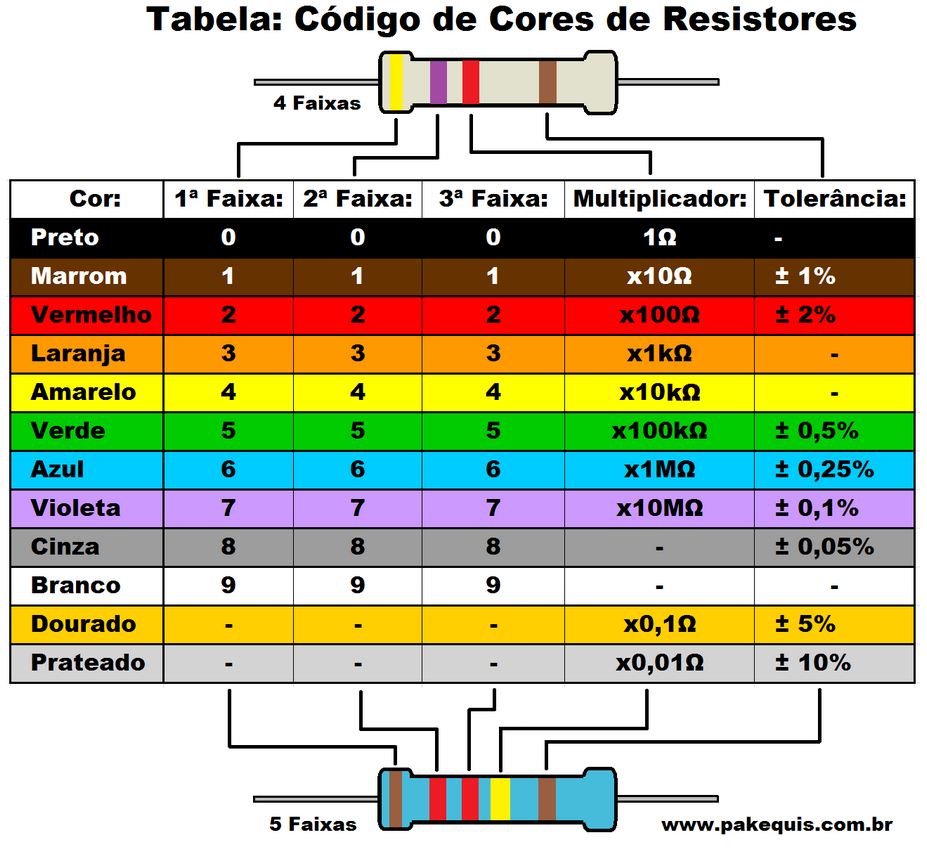

# Mini Tutorial sobre Resistores

## 1. O que é um Resistor?
O **resistor** é um componente eletrônico que **limita a corrente elétrica** em um circuito.  
Sua principal função é **controlar a tensão e corrente** de acordo com a **Lei de Ohm**:

```
V = R · I
```

- **V** → tensão (volts)  
- **R** → resistência (ohms, Ω)  
- **I** → corrente (ampères)

---

## 2. Unidade de Medida
A resistência elétrica é medida em **ohms (Ω)**.  
Multiplicadores comuns:

- 1 kΩ = 1.000 Ω  
- 1 MΩ = 1.000.000 Ω  

---

## 3. Símbolos


---

## 4. Código de Cores de Resistores

Os resistores fixos utilizam **faixas coloridas** para indicar seu valor.  
As 2 ou 3 primeiras cores representam dígitos, a próxima é o **multiplicador** e a última (se houver) é a **tolerância**.

### Tabela de Cores



---

## 5. Exemplo de Leitura
Resistor com **faixas: Vermelho – Violeta – Marrom – Dourado**  
- Vermelho = 2  
- Violeta = 7  
- Marrom = ×10  
- Dourado = ±5%  

**Valor:**  
```
27 × 10 = 270 Ω ± 5%
```

---

## 6. Aplicações
- Limitar corrente em LEDs.  
- Divisores de tensão.  
- Ajuste de ganho em amplificadores.  
- Resistores de carga em fontes.

---


