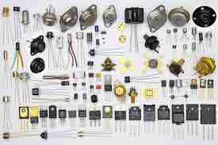
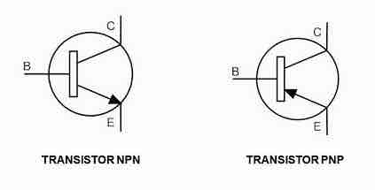
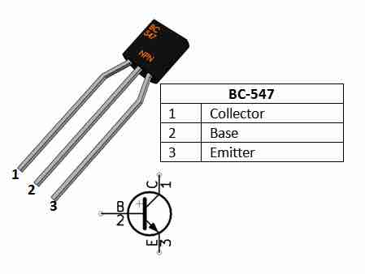
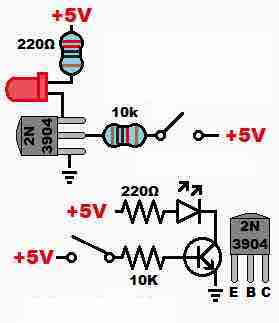

# Mini Tutorial sobre Transistores BJT

## 1. O que é um Transistor BJT?
O **BJT (Bipolar Junction Transistor)** é um componente eletrônico semicondutor que pode atuar como **chave** ou **amplificador**.  
Ele é chamado de "bipolar" porque utiliza tanto elétrons quanto lacunas para conduzir corrente.  
O BJT é formado por **três camadas semicondutoras** que criam duas junções (NPN ou PNP).

---

## 2. Estrutura e Terminais
O BJT possui três terminais principais:

- **Base (B)** → controla a passagem de corrente.  
- **Coletor (C)** → recebe a corrente principal.  
- **Emissor (E)** → libera a corrente para o circuito.

### Tipos:
- **NPN** → a corrente flui do **coletor para o emissor** quando a base recebe corrente positiva.  
- **PNP** → a corrente flui do **emissor para o coletor** quando a base recebe corrente negativa.

---

## 3. Funcionamento do BJT
O princípio básico é:  
👉 **Uma pequena corrente na base controla uma corrente muito maior entre coletor e emissor.**

Isso torna o BJT útil como:
- **Chave** → liga e desliga cargas (LEDs, relés, motores).  
- **Amplificador** → aumenta sinais de áudio, rádio e instrumentação.  

---

## 4. Modos de Operação
- **Corte** → sem corrente na base → transistor **desligado**.  
- **Saturação** → corrente suficiente na base → transistor **ligado**, conduzindo quase totalmente.  
- **Ativo** → região intermediária → usado para **amplificação**.

  
---

## 5. Exemplo Prático: Acionando um LED

Quando aplicamos uma corrente na base, o BJT permite que a corrente flua do coletor para o emissor, acendendo o LED.

